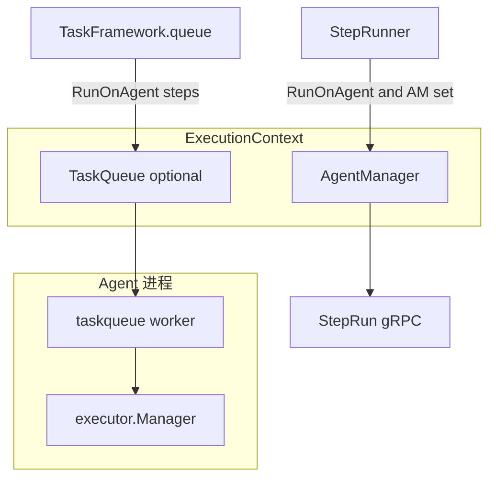

# Pipeline 执行栈盘点与端到端关系

本文档落实「Pipeline 核心流程」计划中的 **inventory-callers**：梳理 `internal/shared/pipeline` 执行栈、Agent/队列与控制面 HTTP 的**实际连接**，并标出当前缺口。

**生成方式**：对仓库 `*.go` 的静态检索（`NewPipelineRunner`、`NewPipelineExecutor`、`TaskQueue`、`AgentManager`、`TriggerRun` 等）；**不修改**计划文件本身。

---

## 1. 执行栈组件（库内入口）

| 组件 | 构造入口 | 职责 |
|------|----------|------|
| **DSL Processor** | `dsl.NewDSLProcessor` → `Processor.ProcessConfig` | 解析 DSL、变量解析、校验；产出 `*spec.Pipeline` + `*ExecutionContext` |
| **Runner** | `pipeline.NewPipelineRunner(execCtx)` | 按 `job.concurrency` 分组并行/串行；每 job 使用 `JobRunner` |
| **Executor** | `pipeline.NewPipelineExecutor` / `NewPipelineExecutorWithQueue` | DAG + `Reconciler` + `TaskFramework`；可选注入 `nova.TaskQueue` |
| **JobRunner** | `NewJobRunner`（由 Runner 内部创建） | `when` → `source` / `approval` → 顺序 `StepRunner` → `target` / `notify` |
| **TaskFramework** | `NewTaskFramework`（由 Executor 内部创建） | prepare → create → start → **queue**（`RunOnAgent` + TaskQueue）→ wait（逐步 `StepRunner`） |
| **StepRunner** | `NewStepRunner` | `RunOnAgent` + `AgentManager` → `executeOnAgent`；否则 builtin / plugin |
| **AgentManager** | `pipeline.NewAgentManager` | 选 Agent、创建 StepRun（gRPC）、轮询完成 |
| **Agent TaskQueue** | `nova.NewTaskQueue`（agent bootstrap） | Agent 侧消费 `StepRunTaskPayload`，转 `executor.Manager` |

**结论（调用方）**：在当前仓库中，`NewPipelineRunner` / `NewPipelineExecutor` **仅在** `internal/shared/pipeline` 包内定义；**未发现** `cmd/`、`internal/control/`、`internal/case/` 等位置对二者的直接调用。即：**共享执行引擎已具备，控制面「触发后启动 Runner/Executor」的 wiring 尚未在主干检索路径中落地**（或位于未索引的生成代码/分支外服务中，需后续人工确认）。

---

## 2. Agent 与队列两条路径



- **路径 A（同步 RPC）**：`StepRunner` → `AgentManager.ExecuteStepOnAgent` → 创建 StepRun → **阻塞等待**完成。代码：`internal/shared/pipeline/pipeline_step_runner.go`、`agent_manager.go`。
- **路径 B（队列）**：`TaskFramework.queue` 在 `ExecutionContext.TaskQueue != nil` 时对 `RunOnAgent` 的 step 调用 `nova.TaskQueue.Enqueue`。Agent 侧：`internal/agent/modules/taskqueue/worker.go` → `PayloadToExecutionRequest` → `executor.Manager`。控制面是否在创建 `Executor` 时注入同一队列，需在 wiring 层核实。

**注意**：两条路径均与 `RunOnAgent` 相关；同一运行配置若同时设置 `AgentManager` 与 `TaskQueue`，需避免重复下发（见 [`architecture_decisions.md`](./architecture_decisions.md)）。

---

## 3. 控制面 HTTP：触发与缺口

| 步骤 | 位置 | 行为 |
|------|------|------|
| Trigger | `internal/adapter/http/router_pipeline.go` `POST .../trigger` | 解析 body（含 `requestId` 字段） |
| Use case | `internal/case/pipeline/usecase.go` `TriggerRun` | 组装 `PipelineRun`，`CreateRun` 落库，`PENDING` |

**缺口**：

1. **HTTP 已解析 `requestId`，但未传入 `TriggerRunInput`**：与设计文档中 Trigger 幂等（`pipeline_id + request_id`）的叙述需对齐实现或文档（见 [`api_design.md`](./api_design.md)）。
2. **Trigger 之后**：未在检索范围内发现「读取仓库 DSL → `ProcessConfig` → `Runner.Run` / `Executor.Execute`」的单一入口；执行推进可能依赖后续 gRPC、异步 worker 或未合并模块。

---

## 4. 建议阅读顺序

- 编排二选一与 Agent 策略：[architecture_decisions.md](./architecture_decisions.md)
- 事件类型映射：[plugin_events_mapping.md](./plugin_events_mapping.md)
- 工作负载语义：[workload_semantics.md](./workload_semantics.md)
- 审批与 Web/IM：[approval_governance.md](./approval_governance.md)

---

## 5. 检索命令备忘（可重复执行）

```bash
rg 'NewPipelineRunner|NewPipelineExecutor|NewPipelineRunner\(' --glob '*.go'
rg 'TriggerRun|CreateRun' --glob '*.go' internal/
rg 'TaskQueue|AgentManager|ExecuteStepOnAgent' --glob '*.go' internal/
```
